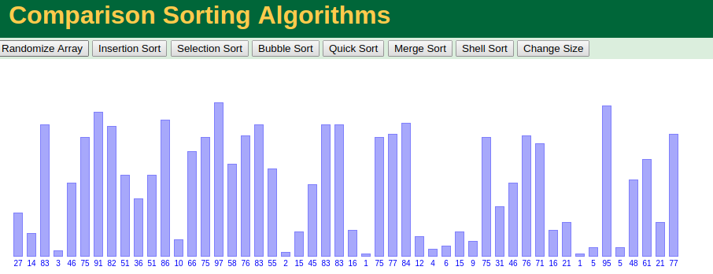
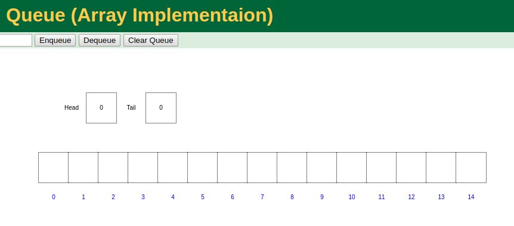

# 数据结构及算法的Go语言实现

在学习数据结构和算法的过程中,根据自己的理解,用Go实现一遍代码.
推荐一本学习数据结构的书:


讲的浅显易懂,语言也很幽默风趣

再推荐一个数据结构和算法的网站 [Data Structure Visualizations](https://www.cs.usfca.edu/~galles/visualization/Algorithms.html)

这个网站里面包含了很多算法,以及动画实现的过程,例如排序:



例如队列的添加删除过程



> 刷题必备网站推荐:
[leetcode](https://leetcode.com/explore/)
[leetcode中文版](https://leetcode-cn.com/explore/)
北大ACM, 网上找相关资料

## 一. 数据结构源码

### 1. 顺序结构线性链表
自己实现了一遍顺序结构链表,写在list.go中,list_test.go是测试代码


## 二. 数据结构相关面试题
面试的时候有一个题目:

题目一:**给定两个非空链表来表示两个非负整数,位数按照逆序方式存储,他们的每个节点只存储单个数字,将两数相加返回一个新的链表.
你可以假设除了数字0之外,这两个数字不会以0开头.**
**示例:**
```
输入:(2->4->3) + (5->6->4)
输出:7->0->8
原因:342+465 = 807
```

在`example/addlist.go`里面实现了, 也有相应的test

题目二. 合并 k 个排序链表，返回合并后的排序链表。
```
输入:
[
    1->4->5,
    1->3->4,
    2->6
]

 输出: 1->1->2->3->4->4->5->6
 ```
在`examples/mergelist.go`里面实现了,也有相应的test

## LeetCode刷题

LeetCode是一个很有意思的网站,在上面做题目很有意思,可以用各种语言去实现.

### [2018.12.05] 完成 Design Circular Queue
[题目地址](https://leetcode.com/explore/learn/card/queue-stack/228/first-in-first-out-data-structure/1337/)

设计一个Circular Queue, 普通的队列,如果一个队列满了,我们就不能再往里面插入数据了,但是循环队列,如果队列满了,可以往前面空出来的位置输入数据 举个例子:

```
MyCircularQueue circularQueue = new MyCircularQueue(3); // set the size to be 3
circularQueue.enQueue(1);  // return true
circularQueue.enQueue(2);  // return true
circularQueue.enQueue(3);  // return true
circularQueue.enQueue(4);  // return false, the queue is full
circularQueue.Rear();  // return 3
circularQueue.isFull();  // return true
circularQueue.deQueue();  // return true
circularQueue.enQueue(4);  // return true
circularQueue.Rear();  // return 4
```

在实现循环队列的时候,我们有几个要注意的地方:
我们定义一个指针`front`来指向队头元素,用`rear`来指向对尾元素的**下一个位置**, 这样当`front == rear`时,我们可以认为**队列为空**.如果`rear`指向的是队尾元素的话,当`front==rear`时,我们无法判断队列为空,还是为满.

**那么如何判断队列是否已满呢(isFull)?**
由于rear可能比front大,也可能比front小,所以有可能他们相差一个位置的时候为满,也有可能是相差整整一圈. 所以若队列的最大长度为QueueSize,那么队列满的条件就是(rear+1)%QueueSize==front

**那么如何计算队列的长度呢?**
我们可以在结构体中设置一个长度,当增加一个元素长度+1,弹出一个元素长度-1,也可以通过front,rear的值来进行计算. 当`rear>front`时,队列的长度等于`rear-front` 当`rear<front`时,队列长度分为两段:一段是`QueueSize-front`,一段是`rear-0`,加在一起就是`rear-front+QueueSize`. 因此通用的计算长度的公式为:

```
length = (rear-front+QueueSize)%QueueSize
```
我自己实现了一遍,代码在`examples/MyCircleQueue.go`中,也有相应的测试代码


